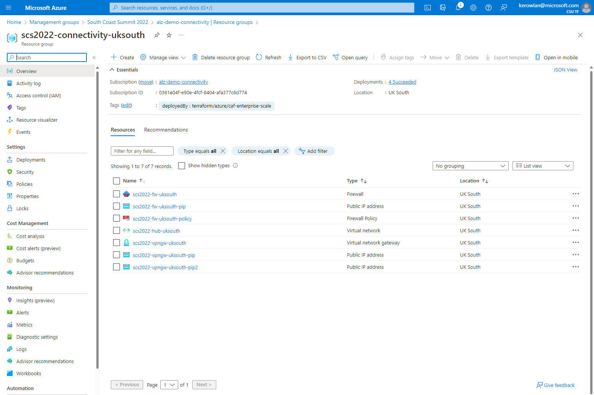

# Azure landing zones Terraform module demo

This demo is intended to show some of the features of the [Azure landing zones Terraform module](https://aka.ms/alz/tf).

## Using the module

### Module structure

This root module consists of the following files, providing am opinionated way to structure your configuration for ease of management:

| File name | Description |
| --- | --- |
| `lib/archetype_definitions/archetype_definition_customer_secure.json` | Defines a [custom archetype definition](https://github.com/Azure/terraform-azurerm-caf-enterprise-scale/wiki/%5BUser-Guide%5D-Archetype-Definitions) called `customer_secure`. This defines creation of the `Deny-Resource-Locations` and `Deny-RSG-Locations` policy assignments, and is applied to the custom `secure` management group. |
| `lib/archetype_exclusions/archetype_exclusion_es_landing_zones.json` | Defines an [archetype exclusion](https://github.com/Azure/terraform-azurerm-caf-enterprise-scale/wiki/%5BExamples%5D-Expand-Built-in-Archetype-Definitions#to-enable-the-exclusion-function) which removes the `Deny-Subnet-Without-Nsg` policy assignment from the builtin `es_landing_zones` archetype definition. |
| `lib/archetype_extensions/archetype_extension_es_root.json` | Defines an [archetype extension](https://github.com/Azure/terraform-azurerm-caf-enterprise-scale/wiki/%5BExamples%5D-Expand-Built-in-Archetype-Definitions#to-enable-the-extension-function) which adds the `Deny-Resource-Locations` and `Deny-RSG-Locations` policy assignments to the builtin `es_root` archetype definition. |
| `client_config.tf` | Contains multiple `azurerm_client_config` resources used to read client configuration data used by the module. |
| `locals.tf` | Contains mappings of all input variables to `locals`, to allow consistent transformation of the inputs where needed across the module. For example, not that a `coalesce()` function is used to populate the `subscription_id_` locals with valid values regardless of input variable values provided. |
| `main.tf` | Contains 3 declarations of the `caf-enterprise-scale` module, showing a simple example of how your deployment can be "modularized" for `core`, `connectivity` and `management` resources. _Further modularization is possible, but beyond the scope of this demo._ |
| `outputs.tf` | To make it easier to understand the list of resources being created by this module, we have included a single output which dynamically generates an output containing the resource IDs of all resources created by the module, grouped by module scope and resource type. |
| `providers.tf` | To simplify scenarios were a customer may or may not have access to multiple subscriptions, we have pre-configured 3 providers as needed by the module to enable deployment of `connectivity` and `management` resources to the expected target subscriptions. The `subscription_id` for each provider is determined from the input variables, and `locals` are used to ensure each provider block has a valid input regardless of how many subscriptions are specified. |
| `settings.connectivity.tf` | Contains configuration settings to customize the `connectivity` resources, including additional logic to only deploy a network hub into the secondary location if a value is provided for the `secondary_location` input variable. |
| `settings.core.tf` | Contains configuration settings to customize the management group hierarchy. |
| `settings.identity.tf` | Contains configuration settings to customize the policy settings applied to the `identity` management group. Note that no Azure resources are deployed by this module for `identity`. |
| `settings.management.tf` | Contains configuration settings to customize the `management` resources, including additional logic to set the `email_security_contact` value used when configuring Microsoft Defender for Cloud policies. |
| `terraform.tf` | Contains the required `terraform` configuration, including a valid `required_providers` block, and re-configuration of the `local` backend. |
| `variables.tf` | Contains all input variables defined for this demo, showing just some of the ways you might want to make customizations to the module configuration for your environment. |

### Deployed resources

Using the default settings provided in this demo will deploy resources covering the following:

- Core management group hierarchy with recommended policies
- Additional "recommended" management groups for `corp` and `online` landing zones
- Additional "custom" management group for `secure` landing zones
- Default management resources recommended for platform monitoring
- Custom connectivity resources to create a basic hub network in the specified `primary_region`
- (OPTIONAL) Custom connectivity resources to create a basic hub network in the specified `secondary_region` with peering to the `primary_region` hub

#### Management group hierarchy

#### Management resources

#### Connectivity resources

##### Primary location

##### Secondary location

##### DNS

## Further information

For further information on how to use an configure the Azure landing zones Terraform module, please refer to our [Wiki](https://github.com/Azure/terraform-azurerm-caf-enterprise-scale/wiki).
